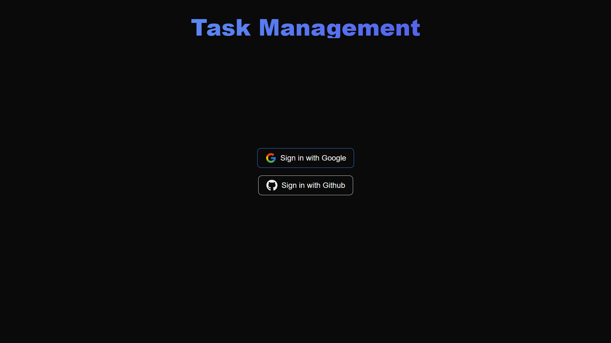
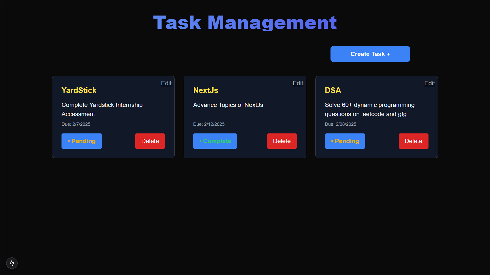

# Task Management - Internship Accessment Project

## Project Links
**Website Link**: &nbsp;[https://task-management-next-js-phi.vercel.app](https://task-management-next-js-phi.vercel.app)
</br>
</br>
**Github Repository**: &nbsp;[https://github.com/manas-agarwal16/Task_Management_NEXTJs](https://github.com/manas-agarwal16/Task_Management_NEXTJs)

## Tech Stack
<div style="display: flex; flex-wrap: wrap; gap: 20px;">
  &nbsp;&nbsp;
  
  &nbsp;&nbsp;&nbsp;&nbsp;&nbsp;&nbsp;&nbsp;
  
  &nbsp;&nbsp;&nbsp;&nbsp;&nbsp;&nbsp;&nbsp;&nbsp;&nbsp;&nbsp;&nbsp;&nbsp;

  
&nbsp;&nbsp;&nbsp;&nbsp;&nbsp;&nbsp;&nbsp;&nbsp;&nbsp;&nbsp;

  
  
</div>
<div style="display: flex; flex-wrap: wrap; gap: 20px;">
 <pre>NEXTJS    TypeScript    TailwindCSS     MongoDB</pre>
</div>

## Screenshots
<table align="center">
  <tr>
    <td></td>
    <td></td>
  </tr>
</table>

## Instructions to set up project

To run the application on your localhost, you need to have node installed on your machine. If you don't have it installed, you can follow the instructions [here](https://nodejs.org/en/download) to install it.

1. Clone the repository  
   </br>
   ```sh
   git clone https://github.com/manas-agarwal16/Task_Management_NEXTJs.git
   ```
2. Navigate to the project directory:  
   </br>
   ```sh
   cd  TASK_MANAGEMENT_NEXTJS
   ```
3. Install NPM packages
   </br>
   ```sh
   npm install
   ```
4. Set up your environment variables
  </br>
   ```sh
   AUTH_SECRET=""
   ```
   ```sh
   AUTH_GITHUB_CLIENT_ID=""
   ```
   ```sh
   AUTH_GITHUB_CLIENT_SECRET=""
   ```
   AUTH_GOOGLE_CLIENT_ID=""
   AUTH_GOOGLE_CLIENT_SECRET=""
   MONGODB_URI=""
5. Run the Application  
   </br>
   ```js
   npm run dev
   ```
